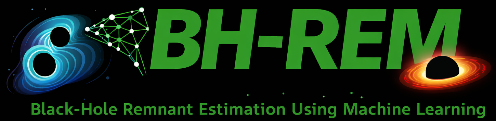

# 

[](https://github.com/rahulshah1397/BH-REM)
[](./LICENSE.md)
[](https://www.python.org/)


# BH-REM: Black-Hole Remnant Estimation using Machine learning

This repository contains a **Master’s-level academic project** exploring the application of basic machine learning techniques to data from **numerical relativity simulations of binary black hole mergers**, which generate gravitational waves.

The project is intentionally exploratory and educational in nature, focusing on understanding both the **physics context** and the **machine learning workflow**, rather than building a production-ready system.

---

### Contributors:
  - [Rahul Shah](https://github.com/rahulshah1397)  
  Indian Association for the Cultivation of Science, Kolkata, India
  - [Shrimon Mukherjee](https://github.com/shrimonmuke0202)  
  Indian Association for the Cultivation of Science, Kolkata, India
   
---

## Project Context

Gravitational waves are ripples in spacetime produced by accelerating massive objects such as merging black holes. Numerical relativity simulations generate accurate gravitational waveforms, but they are computationally expensive.

This project investigates whether **simple machine learning models** can learn relationships between physical parameters (e.g. mass and spin) and features derived from gravitational wave data, using numerical relativity catalogs as input.

---

## Data Source

The data used in this project was derived from **publicly available numerical relativity catalogs of binary black hole mergers**, provided by: https://www.black-holes.org/

These catalogs contain simulation data describing the physical parameters of binary black hole systems (e.g. mass and spin) and their associated gravitational wave signals.

Only a subset of parameters was used for this exploratory machine learning study.

---

## Goals

- Gain hands-on experience working with scientific datasets.
- Apply basic machine learning techniques to a real physics problem.
- Explore relationships between binary black hole parameters and simulated data.
- Build intuition at the intersection of physics and machine learning.

---

## Contents

- `project.ipynb` — Main Jupyter notebook containing data loading, analysis, and ML experiments  
- `data/mass.csv`, `data/spin.csv` — Example input data derived from numerical relativity catalogs
- `utils/logo.png` — Project logo
- `requirements.txt` - List of required Python dependencies

---


## Usage

This project is organized as a Jupyter notebook and is intended to be run in an interactive, exploratory workflow.

### Prerequisites

- Python 3
- `pip`
- Jupyter Notebook

### Installation

First, clone the repository and navigate into it:

```
git clone https://github.com/rahulshah1397/BH-REM.git
cd BH-REM
```

Install the required Python dependencies:

```
pip3 install -r requirements.txt
```

Launch the Jupyter Notebook:

```
jupyter notebook project.ipynb
```
Once the notebook opens in your browser, run the cells sequentially to reproduce the data loading, analysis, and machine learning experiments.

Notes:
1. The notebook reflects an exploratory, research-oriented workflow
2. Results and visualizations are generated inline
3. No additional configuration is required beyond the listed dependencies

---

## Notes on Scope and Limitations

- This was completed as part of a **Master’s project**.
- Models and techniques are intentionally simple.
- The focus is on learning and experimentation rather than performance optimization.
- Code structure reflects an exploratory notebook-based workflow.

---

## License

MIT License
